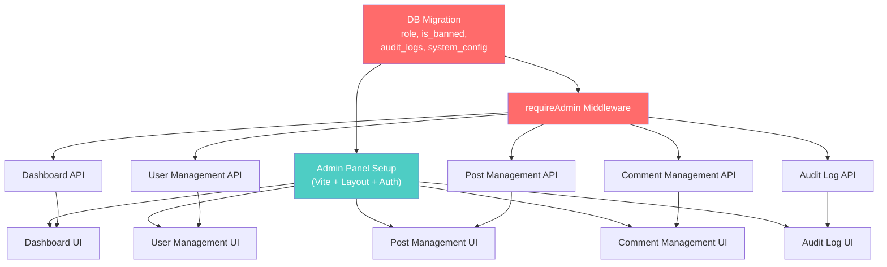

# Outstagram — Admin Panel: Kế Hoạch Triển Khai Dev

> **Version:** 1.0  
> **Tài liệu tham chiếu:** [Admin_Panel_Plan.md](file:///f:/Self/study-with-Groot/Outstagram/docs/Admin_Panel_Plan.md)  
> **Last Updated:** 2026-02-21  
> **Audience:** Developers trực tiếp implement

---

## Table of Contents

1. [Tổng Quan Triển Khai](#1-tổng-quan-triển-khai)
2. [Git Workflow & Branch Strategy](#2-git-workflow--branch-strategy)
3. [Cấu Trúc Monorepo](#3-cấu-trúc-monorepo)
4. [Dependency Graph — Thứ Tự Phát Triển](#4-dependency-graph--thứ-tự-phát-triển)
5. [Sprint Planning Chi Tiết — Phase 1 MVP](#5-sprint-planning-chi-tiết--phase-1-mvp)
6. [Hướng Dẫn Từng Sprint](#6-hướng-dẫn-từng-sprint)
7. [Coding Conventions & Standards](#7-coding-conventions--standards)
8. [Testing Strategy](#8-testing-strategy)
9. [CI/CD & Deployment](#9-cicd--deployment)
10. [Definition of Done (DoD)](#10-definition-of-done-dod)

---

## 1. Tổng Quan Triển Khai

### 1.1 Chiến Lược Tổng Thể

```
                        ADMIN PANEL — LUỒNG TRIỂN KHAI

  ┌─────────────────────────────────────────────────────────────────┐
  │                                                                 │
  │  Backend-first  ──────►  Frontend song song  ──────►  Ghép nối  │
  │                                                                 │
  │  1. DB Migration         3. Admin Panel UI          5. E2E Test │
  │  2. Admin API Routes     4. Kết nối API             6. Deploy   │
  │                                                                 │
  └─────────────────────────────────────────────────────────────────┘
```

**Nguyên tắc triển khai:**

- **Backend-first** — DB migration + API endpoints phải sẵn sàng trước khi frontend bắt đầu kết nối.
- **Frontend song song** — Trong khi backend đang phát triển, frontend có thể dựng layout/UI với mock data.
- **Ghép nối (Integration)** — Kết nối frontend ↔ backend, test end-to-end.
- **Incremental delivery** — Mỗi sprint tạo ra sản phẩm có thể chạy được (dù chưa hoàn chỉnh).

### 1.2 Phân Chia Workstream

| Workstream | Mô Tả | Folder |
|------------|--------|--------|
| **WS-Backend** | Migration, middleware, admin API routes, services | `server/src/` |
| **WS-Frontend** | Admin Panel React app (project riêng trong monorepo) | `admin/` |
| **WS-Shared** | Types, constants, API contract (nếu cần) | `shared/` (optional) |

---

## 2. Git Workflow & Branch Strategy

### 2.1 Branching Model

```
main ─────────────────────────────────────────────────────── Production
  │
  └── develop ────────────────────────────────────────────── Integration
        │
        ├── feature/admin-db-migration ──────────────────── Sprint 1
        ├── feature/admin-auth-middleware ────────────────── Sprint 1
        ├── feature/admin-panel-setup ───────────────────── Sprint 1
        ├── feature/admin-dashboard-api ─────────────────── Sprint 2
        ├── feature/admin-dashboard-ui ──────────────────── Sprint 2
        ├── feature/admin-user-management-api ───────────── Sprint 3
        ├── feature/admin-user-management-ui ────────────── Sprint 3
        ├── feature/admin-post-management ───────────────── Sprint 4
        ├── feature/admin-comment-management ────────────── Sprint 5
        ├── feature/admin-audit-logs ────────────────────── Sprint 5
        └── ...
```

### 2.2 Quy Tắc Branch & PR

| Quy Tắc | Chi Tiết |
|----------|----------|
| **Branch naming** | `feature/admin-<module>-<scope>`, `fix/admin-<issue>`, `chore/admin-<task>` |
| **Commit convention** | `feat(admin): add user management API`, `fix(admin): resolve pagination bug` |
| **PR size** | Tối đa ~400 LOC mỗi PR. Tách PR nhỏ: API → UI → Integration |
| **PR review** | Tối thiểu 1 reviewer approve trước khi merge |
| **Merge strategy** | Squash merge vào `develop`. Merge commit từ `develop` → `main` |
| **Conflict resolution** | Resolve trên feature branch trước khi tạo PR |

### 2.3 PR Template Đề Xuất

```markdown
## What
<!-- Mô tả ngắn gọn thay đổi -->

## Why
<!-- Lý do / context -->

## Checklist
- [ ] API endpoint tested với Postman/Thunder Client
- [ ] UI component render đúng
- [ ] Audit log ghi nhận đúng action  
- [ ] Error handling hoạt động
- [ ] No console errors/warnings
```

---

## 3. Cấu Trúc Monorepo

### 3.1 Cấu Trúc Thư Mục Đề Xuất

Thêm folder `admin/` cùng cấp với `client/` và `server/`:

```
Outstagram/
├── client/                  ← Web App hiện tại (không thay đổi)
├── server/                  ← Backend chung (thêm admin routes)
│   └── src/
│       ├── controllers/
│       │   ├── ...          ← Controllers hiện tại
│       │   └── admin/       ← [NEW] Admin controllers
│       │       ├── admin-dashboard.controller.js
│       │       ├── admin-users.controller.js
│       │       ├── admin-posts.controller.js
│       │       ├── admin-comments.controller.js
│       │       └── admin-audit.controller.js
│       ├── middlewares/
│       │   ├── auth.js       ← Hiện tại
│       │   ├── admin-auth.js ← [NEW] requireAdmin middleware
│       │   └── audit-log.js  ← [NEW] Auto audit logging
│       ├── routes/
│       │   ├── index.js      ← Thêm mount admin routes
│       │   └── admin/        ← [NEW] Admin route files
│       │       ├── index.js
│       │       ├── admin-dashboard.routes.js
│       │       ├── admin-users.routes.js
│       │       ├── admin-posts.routes.js
│       │       ├── admin-comments.routes.js
│       │       └── admin-audit.routes.js
│       └── services/
│           └── admin/        ← [NEW] Admin services
│               ├── admin-dashboard.service.js
│               ├── admin-users.service.js
│               ├── admin-posts.service.js
│               └── admin-audit.service.js
│
├── admin/                    ← [NEW] Admin Panel Frontend
│   ├── index.html
│   ├── package.json
│   ├── vite.config.js
│   └── src/
│       ├── main.jsx
│       ├── App.jsx
│       ├── lib/
│       │   ├── supabase.js
│       │   ├── axios.js       ← API client config
│       │   └── constants.js
│       ├── hooks/
│       │   ├── useAuth.js
│       │   └── useAdmin.js
│       ├── layouts/
│       │   ├── AdminLayout.jsx     ← Sidebar + Header + Content
│       │   └── AuthLayout.jsx      ← Login page layout
│       ├── shared/
│       │   ├── DataTable.jsx       ← Reusable paginated table
│       │   ├── StatCard.jsx        ← Dashboard stat card
│       │   ├── ConfirmDialog.jsx   ← Destructive action confirm
│       │   ├── StatusBadge.jsx     ← Role/status badges
│       │   └── PageHeader.jsx      ← Page title + breadcrumb
│       ├── modules/
│       │   ├── auth/
│       │   │   └── pages/LoginPage.jsx
│       │   ├── dashboard/
│       │   │   ├── pages/DashboardPage.jsx
│       │   │   ├── components/StatsOverview.jsx
│       │   │   ├── components/UserGrowthChart.jsx
│       │   │   └── api/dashboard.api.js
│       │   ├── users/
│       │   │   ├── pages/UserListPage.jsx
│       │   │   ├── pages/UserDetailPage.jsx
│       │   │   ├── components/UserTable.jsx
│       │   │   ├── components/BanUserDialog.jsx
│       │   │   └── api/users.api.js
│       │   ├── posts/
│       │   │   ├── pages/PostListPage.jsx
│       │   │   ├── pages/PostDetailPage.jsx
│       │   │   └── api/posts.api.js
│       │   ├── comments/
│       │   │   ├── pages/CommentListPage.jsx
│       │   │   └── api/comments.api.js
│       │   └── audit-logs/
│       │       ├── pages/AuditLogPage.jsx
│       │       └── api/audit.api.js
│       └── styles/
│           └── global.css
│
├── db/
│   └── migrations/
│       └── 20260221000000_admin_panel_schema.js  ← [NEW]
│
├── knexfile.js
└── package.json
```

---

## 4. Dependency Graph — Thứ Tự Phát Triển

Các task có dependency với nhau. Biểu đồ dưới cho thấy thứ tự **BẮT BUỘC** phải tuân theo:



> **Đỏ** = Backend (phải làm trước)  
> **Xanh** = Frontend (có thể song song với backend nếu dùng mock data)

**Các task có thể phát triển song song:**
- Dashboard API + Dashboard UI (mock data)
- User Management API + User Management UI (mock data)
- Post Management API → Comment Management API (cùng pattern, dev nhanh)
- Tất cả UI pages có thể bắt đầu layout/skeleton trước khi API sẵn sàng

---

## 5. Sprint Planning Chi Tiết — Phase 1 MVP

### Tổng Quan 6 Sprints (mỗi sprint = 1 tuần)

```
Sprint 1 ──► Sprint 2 ──► Sprint 3 ──► Sprint 4 ──► Sprint 5 ──► Sprint 6
Foundation    Dashboard    Users        Posts        Comments      Testing
                                                    + Audit       + Deploy
```

| Sprint | Focus | Backend Tasks | Frontend Tasks | Deliverable |
|--------|-------|---------------|----------------|-------------|
| **1** | Foundation | DB migration, requireAdmin middleware | Vite setup, layout, login page | Admin login hoạt động |
| **2** | Dashboard | Dashboard stats API, charts API | Dashboard page, stat cards, 1 chart | Dashboard hiển thị metrics |
| **3** | Users | User list/detail/ban/unban API | User list page, detail page, ban dialog | Quản lý users cơ bản |
| **4** | Posts | Post list/detail/soft-delete API | Post list page, detail page | Quản lý posts |
| **5** | Comments + Audit | Comment API, Audit log API & middleware | Comment list page, audit log page | Quản lý comments + audit trail |
| **6** | Polish | Bug fixes, edge cases, error handling | UI polish, responsive, loading states | Sẵn sàng deploy |

---

## 6. Hướng Dẫn Từng Sprint

---

### Sprint 1: Foundation & Infrastructure (Tuần 1)

#### 🎯 Mục tiêu
Dựng nền tảng: DB schema, auth middleware, Admin Panel skeleton, login.

#### Backend Tasks

##### Task 1.1 — DB Migration
**File:** `db/migrations/20260221000000_admin_panel_schema.js`

**Nội dung migration:**
```
profiles → thêm cột: role, is_banned, banned_at, banned_reason
Tạo bảng: audit_logs (id, actor_id, action, target_type, target_id, metadata, ip_address, user_agent, created_at)
Tạo bảng: system_config (key, value, updated_by, updated_at)
Tạo indexes cho audit_logs
```

**Bước thực hiện:**
1. Tạo file migration: `npx knex migrate:make admin_panel_schema --knexfile knexfile.js`
2. Viết `up()` migration với các ALTER TABLE và CREATE TABLE
3. Viết `down()` migration (rollback)
4. Chạy: `npx knex migrate:latest --knexfile knexfile.js`
5. Kiểm tra DB: Verify cột mới và bảng mới đã được tạo

##### Task 1.2 — Seed Super Admin
**File:** `db/seeds/001_super_admin.js`

**Bước thực hiện:**
1. Chọn 1 account hiện có (hoặc tạo mới via Supabase Auth)
2. Update `profiles.role = 'super_admin'` cho account đó
3. Có thể dùng seed file hoặc SQL trực tiếp cho lần đầu

##### Task 1.3 — `requireAdmin` Middleware
**File:** `server/src/middlewares/admin-auth.js`

**Logic:**
```
Input: minRole ('moderator' | 'admin' | 'super_admin')
1. Lấy req.userId (đã set bởi requireAuth)
2. Query profiles WHERE user_id = req.userId → lấy role
3. Check is_banned → nếu true → 403
4. So sánh role hierarchy: super_admin(3) > admin(2) > moderator(1) > user(0)
5. Nếu user role >= minRole → next()
6. Nếu không → 403 Forbidden
```

**Bước thực hiện:**
1. Tạo file `server/src/middlewares/admin-auth.js`
2. Export function `requireAdmin(minRole)` return middleware
3. Tạo constant `ROLE_HIERARCHY = { user: 0, moderator: 1, admin: 2, super_admin: 3 }`
4. Test với Postman: gọi một admin endpoint → verify 403 (nếu role = user) vs 200 (nếu role = admin)

##### Task 1.4 — Admin Route Namespace
**File:** `server/src/routes/admin/index.js`

**Bước thực hiện:**
1. Tạo folder `server/src/routes/admin/`
2. Tạo `index.js` — import và mount sub-routes
3. Trong `server/src/routes/index.js`, thêm: `router.use('/v1/admin', requireAuth, adminRoutes)`
4. Tạo endpoint test: `GET /api/v1/admin/ping` → `{ ok: true, role: req.userRole }`

#### Frontend Tasks

##### Task 1.5 — Init Admin Panel Project
**Folder:** `admin/`

**Bước thực hiện:**
1. `cd Outstagram && mkdir admin && cd admin`
2. `npx -y create-vite@latest ./ -- --template react`
3. Install deps:
   ```
   npm install react-router-dom @supabase/supabase-js axios @tanstack/react-query
   npm install antd @ant-design/icons recharts
   ```
4. Tạo `.env`: `VITE_SUPABASE_URL`, `VITE_SUPABASE_ANON_KEY`, `VITE_API_BASE_URL`
5. Cấu hình `vite.config.js` — proxy `/api` → `http://localhost:5000`

##### Task 1.6 — Admin Layout
**Files:** `admin/src/layouts/AdminLayout.jsx`, `AuthLayout.jsx`

**AdminLayout cần có:**
```
┌─────────────────────────────────────────────────────┐
│  Header (logo, user info, logout)                   │
├──────────┬──────────────────────────────────────────┤
│          │                                          │
│ Sidebar  │         Main Content Area                │
│          │         (React Router Outlet)             │
│ - Dash.  │                                          │
│ - Users  │                                          │
│ - Posts  │                                          │
│ - Cmts   │                                          │
│ - Audit  │                                          │
│          │                                          │
└──────────┴──────────────────────────────────────────┘
```

**Bước thực hiện:**
1. Tạo `AdminLayout.jsx` với Ant Design `Layout`, `Sider`, `Menu`
2. Tạo `AuthLayout.jsx` — layout đơn giản cho login page
3. Setup React Router trong `App.jsx`:
   - `/login` → AuthLayout → LoginPage
   - `/` → AdminLayout (protected) → DashboardPage
   - `/users` → AdminLayout → UserListPage
   - ...

##### Task 1.7 — Login Page + Auth Hook
**Files:** `admin/src/modules/auth/pages/LoginPage.jsx`, `admin/src/hooks/useAuth.js`

**Bước thực hiện:**
1. Tạo `useAuth` hook: sử dụng Supabase Auth `signInWithPassword`
2. Sau login → gọi `GET /api/v1/admin/ping` để verify role
3. Nếu role = `user` → hiển thị lỗi "Tài khoản không có quyền admin"
4. Nếu role ≥ moderator → redirect to Dashboard
5. Lưu session vào React Context (hoặc Zustand nếu muốn)

##### ✅ Sprint 1 Definition of Done
- [ ] DB migration chạy thành công, bảng mới đã tạo
- [ ] Super Admin account đã seed
- [ ] `GET /api/v1/admin/ping` trả về role cho admin, 403 cho user thường
- [ ] Admin Panel chạy được trên `localhost:5174` (hoặc port khác)
- [ ] Có thể login và thấy layout (sidebar + header + empty content)

---

### Sprint 2: Dashboard (Tuần 2)

#### 🎯 Mục tiêu
Xây dựng Dashboard với metrics tổng quan và biểu đồ cơ bản.

#### Backend Tasks

##### Task 2.1 — Dashboard Stats API
**File:** `server/src/controllers/admin/admin-dashboard.controller.js`  
**Route:** `GET /api/v1/admin/dashboard/stats`

**Response mẫu:**
```json
{
  "data": {
    "totalUsers": 1234,
    "newUsersLast7d": 56,
    "newUsersLast30d": 234,
    "totalPosts": 5678,
    "newPostsLast7d": 123,
    "totalComments": 9012,
    "totalLikes": 34567,
    "totalFollows": 12345
  }
}
```

**Bước thực hiện:**
1. Tạo `admin-dashboard.service.js` — các hàm query aggregate
2. Mỗi metric là 1 query đơn giản (`SELECT count(*) FROM ...`)
3. Sử dụng `Promise.all()` để chạy song song tất cả queries
4. Tạo controller + route
5. Test: `GET /api/v1/admin/dashboard/stats` → verify data

##### Task 2.2 — Charts Data API
**Route:** `GET /api/v1/admin/dashboard/charts/user-growth?days=30`

**Response mẫu:**
```json
{
  "data": [
    { "date": "2026-02-01", "count": 5 },
    { "date": "2026-02-02", "count": 8 },
    ...
  ]
}
```

**Bước thực hiện:**
1. Tạo query group by `DATE(created_at)`, count
2. Support query params: `days` (7, 30, 90)
3. Tương tự cho `charts/posts-per-day`, `charts/engagement`

#### Frontend Tasks

##### Task 2.3 — Dashboard Page
**File:** `admin/src/modules/dashboard/pages/DashboardPage.jsx`

**Layout:**
```
┌─────────────────────────────────────────────────────┐
│  Dashboard                                         │
├────────┬────────┬────────┬────────┬────────────────┤
│ Total  │ New    │ Total  │ New    │      ...       │
│ Users  │ Users  │ Posts  │ Posts  │                │
│ 1,234  │ 7d:56  │ 5,678  │7d:123 │                │
├────────┴────────┴────────┴────────┴────────────────┤
│                                                     │
│  📈 User Growth (Line Chart — 30 days)              │
│                                                     │
├─────────────────────┬───────────────────────────────┤
│  📊 Posts Per Day   │  🥧 Media Type Breakdown      │
│  (Bar Chart)        │  (Pie Chart)                  │
└─────────────────────┴───────────────────────────────┘
```

**Bước thực hiện:**
1. Tạo `StatCard` component (shared) — icon, label, value, trend
2. Tạo `StatsOverview` component — grid of StatCards
3. Tạo `UserGrowthChart` — Recharts `LineChart`
4. Sử dụng `@tanstack/react-query` — `useQuery` gọi dashboard API
5. Loading skeleton cho cards và charts

##### ✅ Sprint 2 Definition of Done
- [ ] Dashboard API trả về đúng metrics
- [ ] Dashboard UI hiển thị stat cards với real data
- [ ] Ít nhất 1 biểu đồ hoạt động (user growth)
- [ ] Loading states hiển thị đúng khi fetch data

---

### Sprint 3: User Management (Tuần 3)

#### 🎯 Mục tiêu
CRUD users: list, search, view detail, ban/unban.

#### Backend Tasks

##### Task 3.1 — User List API
**Route:** `GET /api/v1/admin/users?page=1&limit=20&search=john&sort=created_at&order=desc`

**Query logic:**
```
SELECT p.user_id, p.username, p.display_name, p.avatar_url,
       p.is_private, p.is_banned, p.role, p.created_at,
       (SELECT count(*) FROM posts WHERE owner_id = p.user_id AND is_deleted = false) as post_count,
       (SELECT count(*) FROM follows WHERE following_id = p.user_id) as follower_count
FROM profiles p
WHERE (p.username ILIKE '%search%' OR p.display_name ILIKE '%search%')
ORDER BY p.created_at DESC
LIMIT 20 OFFSET 0
```

##### Task 3.2 — User Detail API
**Route:** `GET /api/v1/admin/users/:id`

Trả về full profile + aggregated stats (posts, followers, following, likes given, comments).

##### Task 3.3 — Ban/Unban API
**Route:** `POST /api/v1/admin/users/:id/ban`, `POST /api/v1/admin/users/:id/unban`

**Logic:**
1. Check permission (admin trở lên)
2. Check target user không phải admin/super_admin (admin không ban admin)
3. Update `is_banned`, `banned_at`, `banned_reason`
4. Ghi audit log
5. (Optional) Revoke Supabase Auth session

#### Frontend Tasks

##### Task 3.4 — User List Page
**File:** `admin/src/modules/users/pages/UserListPage.jsx`

**Features:**
- Ant Design `Table` component với pagination
- Search bar (debounced 300ms)
- Column sort (username, created_at, post_count)
- Filter: role, banned status
- Action buttons: View, Ban/Unban

##### Task 3.5 — User Detail Page
**File:** `admin/src/modules/users/pages/UserDetailPage.jsx`

**Layout:**
```
┌────────────────────────────────────────────────────┐
│ ← Back     User Detail: @johndoe                   │
├────────────┬───────────────────────────────────────┤
│            │  John Doe (@johndoe)                  │
│  [Avatar]  │  Role: User  |  Status: Active        │
│            │  Bio: "Hello world..."                 │
│            │  Joined: 2026-01-15                    │
├────────────┴───────────────────────────────────────┤
│  Posts: 45  |  Followers: 234  |  Following: 123   │
├────────────────────────────────────────────────────┤
│  [Ban User]  [Edit Profile]                        │
├────────────────────────────────────────────────────┤
│  Recent Posts (table — mini version)                │
└────────────────────────────────────────────────────┘
```

##### Task 3.6 — Ban User Dialog
**File:** `admin/src/modules/users/components/BanUserDialog.jsx`

- Modal xác nhận với field nhập lý do ban
- Loading spinner khi calling API
- Success/Error toast sau khi hoàn thành
- Refetch user list sau khi ban thành công

##### ✅ Sprint 3 Definition of Done
- [ ] User list hiển thị đúng, phân trang hoạt động
- [ ] Search users hoạt động (debounced)
- [ ] User detail page hiển thị toàn bộ thông tin + stats
- [ ] Ban/Unban hoạt động + audit log ghi nhận
- [ ] Banned user không thể login (middleware check)

---

### Sprint 4: Post Management (Tuần 4)

#### 🎯 Mục tiêu
Quản lý posts: list, filter, view detail, soft-delete/restore.

#### Backend Tasks

##### Task 4.1 — Post List API
**Route:** `GET /api/v1/admin/posts?page=1&limit=20&status=all&owner_id=xxx`

**Query trả về:** id, owner (username, avatar), caption (truncated 100 chars), media count, likes count, comments count, is_deleted, created_at.

##### Task 4.2 — Post Detail API
**Route:** `GET /api/v1/admin/posts/:id`

Trả về: full caption, media gallery URLs, comments list (paginated), likes count, owner info.

##### Task 4.3 — Soft-delete / Restore API
**Route:** `PATCH /api/v1/admin/posts/:id/soft-delete`

**Body:** `{ "is_deleted": true }` hoặc `{ "is_deleted": false }`

Ghi audit log với old/new state.

#### Frontend Tasks

##### Task 4.4 — Post List Page
- Table với columns: ID, Owner, Caption (truncated), Media, Likes, Comments, Status, Created
- Filter by: status (active/deleted/all), owner
- Action: View Detail, Soft-delete / Restore

##### Task 4.5 — Post Detail Page
- Hiển thị media gallery, full caption
- Comments thread (read-only)
- Actions: Soft-delete, Restore

##### ✅ Sprint 4 Definition of Done
- [ ] Post list phân trang, filter hoạt động
- [ ] Post detail hiển thị media + comments
- [ ] Soft-delete / Restore hoạt động + audit log
- [ ] Deleted posts hiển thị khác biệt (strikethrough / gray)

---

### Sprint 5: Comments + Audit Logs (Tuần 5)

#### 🎯 Mục tiêu
Comment management + Audit log system hoàn chỉnh.

#### Backend Tasks

##### Task 5.1 — Comment List API
**Route:** `GET /api/v1/admin/comments?page=1&post_id=xxx&user_id=xxx`

##### Task 5.2 — Comment Soft-delete API
**Route:** `PATCH /api/v1/admin/comments/:id/soft-delete`

##### Task 5.3 — Audit Log Middleware
**File:** `server/src/middlewares/audit-log.js`

**Logic:**
```
function auditLog(action, targetType) {
  return async (req, res, next) => {
    // Sau khi response gửi xong (res.on('finish'))
    // Ghi vào audit_logs: actor_id, action, target_type, target_id, metadata, ip, user_agent
  }
}
```

Áp dụng lên tất cả admin mutation routes.

##### Task 5.4 — Audit Log List API
**Route:** `GET /api/v1/admin/audit-logs?page=1&actor_id=xxx&action=user.ban&from=2026-02-01&to=2026-02-21`

#### Frontend Tasks

##### Task 5.5 — Comment List Page
- Table: ID, Post ID, User, Content (truncated), Status, Created
- Link đến Post Detail từ Post ID

##### Task 5.6 — Audit Log Page
- Table: Timestamp, Actor, Action, Target, Details
- Filter: Actor, Action type, Date range
- Expandable row → hiển thị full metadata JSON
- Chỉ hiển thị cho admin+ (moderator không thấy menu item này)

##### ✅ Sprint 5 Definition of Done
- [ ] Comment list + soft-delete hoạt động
- [ ] Mọi admin action tự động ghi audit log
- [ ] Audit log page hiển thị đúng, filter hoạt động
- [ ] Sidebar menu ẩn Audit Logs cho moderator

---

### Sprint 6: Testing & Polish (Tuần 6)

#### 🎯 Mục tiêu
E2E testing, bug fixes, UI polish, deployment setup.

#### Tasks

##### Task 6.1 — API Integration Testing
- Test tất cả admin endpoints với Postman Collection
- Test các edge cases: unauthorized access, invalid data, pagination boundaries
- Export Postman collection vào `docs/postman/`

##### Task 6.2 — Auth Edge Cases
- Token expired → redirect to login
- User role bị revoke giữa session → verify middleware reject
- Banned admin → verify không thể login

##### Task 6.3 — UI Polish
- Loading skeletons cho tất cả pages
- Empty states ("Không có dữ liệu")
- Error states (API fail → retry button)
- Responsive sidebar collapse
- Consistent spacing, typography, colors

##### Task 6.4 — Deployment
- Build admin panel: `cd admin && npm run build`
- Deploy options:
  - **Option A:** Serve static từ Express (`/admin` → `admin/dist`)
  - **Option B:** Deploy riêng lên Vercel/Netlify (recommended)
- Cấu hình CORS cho admin domain
- Environment variables cho production

##### ✅ Sprint 6 Definition of Done
- [ ] Tất cả API endpoints tested (manual + Postman collection)
- [ ] Không có console errors
- [ ] Loading/empty/error states hoàn chỉnh
- [ ] Deployment thành công, admin panel accessible
- [ ] Super Admin có thể thực hiện full workflow: login → view dashboard → manage users → view audit logs

---

## 7. Coding Conventions & Standards

### 7.1 Backend

| Convention | Rule |
|------------|------|
| **File naming** | `kebab-case.js` — `admin-users.controller.js` |
| **Function naming** | `camelCase` — `listUsers`, `banUser` |
| **Controller pattern** | Thin controller → call service → return response |
| **Error handling** | Sử dụng `errors` utils pattern hiện tại (`api-error.js`) |
| **Response format** | Sử dụng `res.ok(data)`, `res.created(data)` — pattern hiện tại |
| **Pagination** | `{ data: [...], pagination: { page, limit, total, totalPages } }` |

### 7.2 Frontend

| Convention | Rule |
|------------|------|
| **File naming** | `PascalCase.jsx` cho components, `camelCase.js` cho utils/hooks |
| **Component pattern** | Functional component + hooks |
| **API calls** | TanStack Query — `useQuery`, `useMutation` |
| **State** | Server state → TanStack Query. Local UI state → `useState` |
| **Styling** | Ant Design components + custom CSS overrides |
| **Import order** | React → Libraries → Components → Hooks → Utils → Styles |

---

## 8. Testing Strategy

| Level | Tool | Scope | Sprint |
|-------|------|-------|--------|
| **API Manual** | Postman / Thunder Client | Mỗi endpoint test ngay khi implement | 1–5 |
| **Middleware Unit** | Vitest (optional) | `requireAdmin`, `auditLog` | 1 |
| **Frontend Smoke** | Dev browser | Mỗi page verify render + basic interaction | 2–5 |
| **E2E Flow** | Manual checklist | Full admin workflow | 6 |
| **Postman Collection** | Exported `.json` | CI/CD regression | 6 |

### Test Scenarios Bắt Buộc

```
Auth
├── ✅ Login với admin account → success
├── ✅ Login với user account → reject
├── ✅ Expired token → redirect login
└── ✅ Banned admin → reject

Permissions
├── ✅ Moderator → chỉ xem posts/comments, không xem users
├── ✅ Admin → manage users, posts, comments
├── ✅ Super Admin → toàn quyền
└── ✅ Role escalation blocked (admin tự nâng → reject)

Data
├── ✅ Pagination (page 1, 2, last, beyond)
├── ✅ Search (partial match, no results, special chars)
├── ✅ Sort (asc, desc, multiple columns)
└── ✅ Filter (combined filters, reset)

Actions
├── ✅ Ban user → user bị block login
├── ✅ Unban user → user login lại được
├── ✅ Soft-delete post → post ẩn on feed
├── ✅ Restore post → post hiện lại
└── ✅ Mọi action → audit log recorded
```

---

## 9. CI/CD & Deployment

### 9.1 Development Environment

```
# Terminal 1 — Backend
cd server && npm run dev         # localhost:5000

# Terminal 2 — Admin Panel
cd admin && npm run dev          # localhost:5174 (Vite default)

# Terminal 3 — Client (nếu cần test song song)
cd client && npm run dev         # localhost:5173
```

### 9.2 Production Deployment

| Component | Platform | URL |
|-----------|----------|-----|
| Backend (API) | Render | `https://api.outstagram.xxx` |
| Web App (client) | Vercel / Netlify | `https://outstagram.xxx` |
| Admin Panel | Vercel / Netlify (riêng) | `https://admin.outstagram.xxx` |

### 9.3 Environment Variables — Admin Panel

```env
# admin/.env.production
VITE_SUPABASE_URL=https://xxxxx.supabase.co
VITE_SUPABASE_ANON_KEY=eyJhbGci...
VITE_API_BASE_URL=https://api.outstagram.xxx
```

---

## 10. Definition of Done (DoD)

### Per-Sprint DoD

Mỗi sprint coi là **Done** khi:

- [ ] Tất cả tasks trong sprint đã implement
- [ ] API endpoints đã test manual (Postman)
- [ ] UI pages đã verify trên browser (Chrome)
- [ ] Không có console errors/warnings
- [ ] Code đã push lên branch, PR đã tạo
- [ ] PR đã được review (ít nhất 1 approver)
- [ ] Branch đã merge vào `develop`

### Phase 1 MVP DoD

Phase 1 coi là **Done** khi:

- [ ] Super Admin có thể login → xem dashboard → quản lý users → quản lý posts → quản lý comments → xem audit logs
- [ ] Moderator có thể login → xem dashboard → xem/delete posts, comments
- [ ] User thường bị reject khi truy cập admin
- [ ] Banned user không thể login
- [ ] Tất cả admin actions ghi audit log
- [ ] Admin Panel đã deploy và accessible

---

> **Ready to start?** Bắt đầu Sprint 1, Task 1.1: DB Migration.
