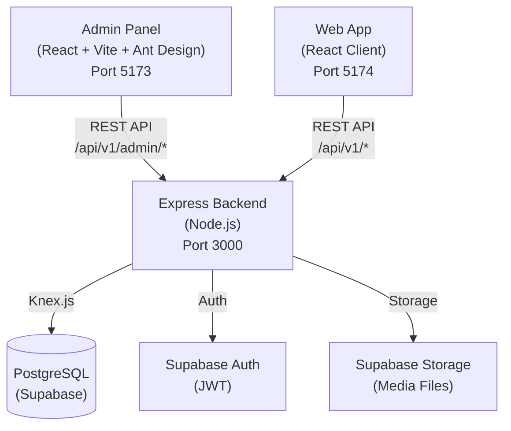

# 📋 Outstagram Admin Panel — Báo Cáo Tổng Hợp Toàn Bộ

> **Dự án:** Outstagram — Social Media Platform  
> **Module:** Admin Panel (Bảng điều khiển quản trị)  
> **Ngày hoàn thành:** 22/02/2026  
> **Trạng thái:** ✅ Hoàn thành Phase 1 + Phase 2 + Refactoring

---

## Mục Lục

1. [Tổng quan kiến trúc](#1-tổng-quan-kiến-trúc)
2. [Tech Stack](#tech-stack)
3. [Hệ thống phân quyền RBAC](#2-hệ-thống-phân-quyền-rbac)
4. [Database Schema Changes](#3-database-schema-changes)
5. [Chi tiết từng Module](#4-chi-tiết-từng-module)
6. [Cấu trúc thư mục sau refactoring](#5-cấu-trúc-thư-mục-sau-refactoring)
7. [Refactoring — Những gì đã làm](#6-refactoring--những-gì-đã-làm)
8. [Bug Fixes đáng chú ý](#7-bug-fixes-đáng-chú-ý)
9. [Tổng kết số liệu](#8-tổng-kết-số-liệu)
10. [Tính năng bảo mật](#9-tính-năng-bảo-mật)
11. [Phase 3 (Tùy chọn tương lai)](#10-phase-3-tùy-chọn-tương-lai)

---

## 1. Tổng Quan Kiến Trúc

Admin Panel là một **ứng dụng React riêng biệt** (tách khỏi Web App người dùng), giao tiếp với cùng một backend Express API thông qua các endpoint có phân quyền admin tại namespace `/api/v1/admin/*`.



### Tech Stack

| Layer | Công nghệ | Phiên bản |
|-------|-----------|-----------|
| **Frontend Framework** | React (Vite) | React 18, Vite 7.x |
| **UI Library** | Ant Design | v5 |
| **Data Fetching** | TanStack Query (React Query) | v5 |
| **Charts** | Recharts | v2 |
| **Routing** | React Router | v6 |
| **State Management** | Zustand | v4 |
| **Auth** | Supabase Auth (JWT) | — |
| **Backend** | Express.js (ES Modules) | Node.js 20+ |
| **Database** | PostgreSQL | Supabase |
| **ORM / Query Builder** | Knex.js | v3 |

---

## 2. Hệ Thống Phân Quyền (RBAC)

Admin Panel sử dụng hệ thống phân quyền RBAC 3 cấp, kiểm tra qua middleware `requireAdmin(minRole)` trên mỗi API request.

| Role | Quyền hạn |
|------|-----------|
| **Super Admin** | Toàn quyền: quản lý users, content, roles, system config, audit logs |
| **Admin** | Quản lý users (ban/unban/create), posts, comments, reports. Không thể sửa system config hay role |
| **Moderator** | Chỉ xem và xử lý reports, soft-delete content. Không truy cập dữ liệu nhạy cảm |

```
Request → requireAuth() → requireAdmin(minRole) → Controller → Database
```

---

## 3. Database Schema Changes

### Cột mới trong bảng `profiles`

| Cột | Kiểu | Mô tả |
|-----|------|-------|
| `role` | TEXT | `'user'`, `'moderator'`, `'admin'`, `'super_admin'` |
| `is_banned` | BOOLEAN | Trạng thái bị ban |
| `banned_at` | TIMESTAMPTZ | Thời gian bị ban |
| `banned_reason` | TEXT | Lý do bị ban |

### Bảng mới

| Bảng | Mục đích | Cột chính |
|------|----------|-----------|
| `audit_logs` | Ghi lại mọi hành động admin | `actor_id`, `action`, `target_type`, `target_id`, `metadata`, `created_at` |
| `system_config` | Cấu hình hệ thống key-value | `key` (TEXT UNIQUE), `value` (JSONB), `updated_by`, `updated_at` |
| `reports` | Hệ thống báo cáo vi phạm | `reporter_id`, `target_type`, `target_id`, `reason`, `status`, `resolved_by`, `resolved_at` |

---

## 4. Chi Tiết Từng Module

---

### 4.1 🔐 Login & Authentication

| Item | Chi tiết |
|------|----------|
| Frontend | [Login.jsx](file:///f:/Self/study-with-Groot/Outstagram/admin/src/pages/Login/Login.jsx) + [Login.css](file:///f:/Self/study-with-Groot/Outstagram/admin/src/pages/Login/Login.css) |
| Auth Store | [authStore.js](file:///f:/Self/study-with-Groot/Outstagram/admin/src/store/authStore.js) |
| API Client | [axios.js](file:///f:/Self/study-with-Groot/Outstagram/admin/src/api/axios.js) |

**Chức năng:**
- Đăng nhập bằng Email + Password qua Supabase Auth
- Chỉ cho phép user có `role ≠ 'user'` truy cập Admin Panel
- JWT token tự động gắn vào header `Authorization` mỗi request (qua Axios interceptor)
- Response interceptor tự động unwrap `response.data` — các query chỉ cần `return res.data`
- Session timeout theo Supabase config

---

### 4.2 📊 Dashboard & Analytics

| Item | Chi tiết |
|------|----------|
| Backend | [dashboard.routes.js](file:///f:/Self/study-with-Groot/Outstagram/server/src/routes/admin/dashboard.routes.js) |
| Frontend | [Dashboard.jsx](file:///f:/Self/study-with-Groot/Outstagram/admin/src/pages/Dashboard/Dashboard.jsx) + [Dashboard.css](file:///f:/Self/study-with-Groot/Outstagram/admin/src/pages/Dashboard/Dashboard.css) |

**API Endpoints:**

| Endpoint | Chức năng |
|----------|-----------|
| `GET /dashboard/stats` | Tổng users, posts, comments, pending reports |
| `GET /dashboard/charts/user-growth` | Biểu đồ tăng trưởng user 30 ngày gần nhất |
| `GET /dashboard/charts/post-activity` | Biểu đồ bài viết mới mỗi ngày |
| `GET /dashboard/charts/engagement` | Biểu đồ likes + comments theo ngày |

**Giao diện:**
- 4 stat cards với gradient màu sắc (tím/xanh/vàng/đỏ): Total Users, Total Posts, Total Comments, Pending Reports
- 3 biểu đồ Recharts:
  - **User Growth** — AreaChart gradient tím
  - **Post Activity** — AreaChart gradient xanh
  - **Engagement Overview** — BarChart (Likes tím + Comments vàng)


---

### 4.3 👥 User Management

| Item | Chi tiết |
|------|----------|
| Backend | [users.routes.js](file:///f:/Self/study-with-Groot/Outstagram/server/src/routes/admin/users.routes.js) |
| Frontend | [Users.jsx](file:///f:/Self/study-with-Groot/Outstagram/admin/src/pages/Users/Users.jsx) + [Users.css](file:///f:/Self/study-with-Groot/Outstagram/admin/src/pages/Users/Users.css) |

**API Endpoints:**

| Endpoint | Quyền | Chức năng |
|----------|-------|-----------|
| `GET /users` | Admin+ | Danh sách users phân trang, tìm kiếm theo username/display_name |
| `GET /users/:id` | Admin+ | Chi tiết user + thống kê (posts, followers, following, comments) |
| `POST /users` | Admin+ | Tạo user mới (qua Supabase Auth Admin API), password auto-generated nếu bỏ trống |
| `POST /users/:id/ban` | Admin+ | Ban user (lý do bắt buộc), ghi audit log |
| `POST /users/:id/unban` | Admin+ | Unban user, ghi audit log |

**Giao diện:**
- Bảng danh sách users có phân trang + tìm kiếm
- Nút **"Create User"** — Modal tạo user mới (Email, Username, Full Name, Password (tùy chọn), Role)
- Nút **"Details"** — Modal xem chi tiết: avatar, display name, username, role tag, activity stats (posts/comments/followers/following), account info (ID, type, join date, ban status)
- Nút **"Ban/Unban"** — Confirmation dialog trước khi thực hiện

````carousel

<!-- slide -->

<!-- slide -->

````

---

### 4.4 📝 Post Management

| Item | Chi tiết |
|------|----------|
| Backend | [posts.routes.js](file:///f:/Self/study-with-Groot/Outstagram/server/src/routes/admin/posts.routes.js) |
| Frontend | [Posts.jsx](file:///f:/Self/study-with-Groot/Outstagram/admin/src/pages/Posts/Posts.jsx) + [Posts.css](file:///f:/Self/study-with-Groot/Outstagram/admin/src/pages/Posts/Posts.css) |

**API Endpoints:**

| Endpoint | Quyền | Chức năng |
|----------|-------|-----------|
| `GET /posts` | Moderator+ | Danh sách posts phân trang, tìm kiếm theo caption |
| `GET /posts/:id` | Moderator+ | Chi tiết post + owner info + media files + likes/comments count |
| `PATCH /posts/:id/soft-delete` | Moderator+ | Toggle soft-delete bài viết, ghi audit log |
| `DELETE /posts/:id` | Super Admin | Hard-delete vĩnh viễn |

**Giao diện:**
- Bảng danh sách posts (Owner, Caption preview, Status tag, Posted date)
- Nút **"View"** — Modal chi tiết: thông tin người đăng (avatar + name), caption đầy đủ, **gallery ảnh/video đính kèm** (sử dụng `Image.PreviewGroup` — click vào ảnh để xem full-size lightbox), engagement stats (likes/comments)
- Nút **"Delete/Restore"** — Toggle soft-delete với confirmation dialog
- Rows bị deleted highlight đỏ nhạt


---

### 4.5 💬 Comment Management

| Item | Chi tiết |
|------|----------|
| Backend | [comments.routes.js](file:///f:/Self/study-with-Groot/Outstagram/server/src/routes/admin/comments.routes.js) |
| Frontend | [Comments.jsx](file:///f:/Self/study-with-Groot/Outstagram/admin/src/pages/Comments/Comments.jsx) + [Comments.css](file:///f:/Self/study-with-Groot/Outstagram/admin/src/pages/Comments/Comments.css) |

**API Endpoints:**

| Endpoint | Quyền | Chức năng |
|----------|-------|-----------|
| `GET /comments` | Moderator+ | Danh sách comments phân trang, tìm kiếm |
| `PATCH /comments/:id/soft-delete` | Moderator+ | Toggle soft-delete comment, ghi audit log |
| `DELETE /comments/:id` | Super Admin | Hard-delete vĩnh viễn |

**Giao diện:**
- Bảng danh sách (User, Content preview, Post ID, Status, Date)
- Nút **"Delete/Restore"** với confirmation dialog

---

### 4.6 🚨 Reports System

| Item | Chi tiết |
|------|----------|
| Backend | [reports.routes.js](file:///f:/Self/study-with-Groot/Outstagram/server/src/routes/admin/reports.routes.js) |
| Frontend | [Reports.jsx](file:///f:/Self/study-with-Groot/Outstagram/admin/src/pages/Reports/Reports.jsx) + [Reports.css](file:///f:/Self/study-with-Groot/Outstagram/admin/src/pages/Reports/Reports.css) |

**API Endpoints:**

| Endpoint | Quyền | Chức năng |
|----------|-------|-----------|
| `GET /reports` | Moderator+ | Danh sách reports, lọc theo status + target_type |
| `PATCH /reports/:id/resolve` | Moderator+ | Đánh dấu "resolved", ghi audit log |
| `PATCH /reports/:id/dismiss` | Moderator+ | Dismiss report (bỏ qua), ghi audit log |

**Giao diện:**
- Bảng "Reports Queue" hiển thị: ID, Reporter, Target (type+id), Reason, Status, Resolved By, Date
- Filter dropdown: **Status** (Pending/Resolved/Dismissed) + **Type** (Post/Comment/Profile)
- Nút **"Resolve"** và **"Dismiss"** — chỉ active khi status là `pending`

---

### 4.7 🛡️ Role Management

| Item | Chi tiết |
|------|----------|
| Backend | [roles.routes.js](file:///f:/Self/study-with-Groot/Outstagram/server/src/routes/admin/roles.routes.js) |
| Frontend | [Roles.jsx](file:///f:/Self/study-with-Groot/Outstagram/admin/src/pages/Roles/Roles.jsx) + [Roles.css](file:///f:/Self/study-with-Groot/Outstagram/admin/src/pages/Roles/Roles.css) |

**API Endpoints:**

| Endpoint | Quyền | Chức năng |
|----------|-------|-----------|
| `GET /roles/admins` | Admin+ | Danh sách tất cả users có role ≠ 'user' |
| `PATCH /roles/:id/role` | Super Admin | Thay đổi role (user/moderator/admin/super_admin), ghi audit log |

**Giao diện:**
- Bảng admin users: Username, Display Name, Current Role (color tag + crown icon cho Super Admin), Joined
- Dropdown **"Change Role"** — chỉ Super Admin mới có quyền edit, confirmation dialog trước khi đổi
- Admin/Moderator chỉ xem (View Only mode)


---

### 4.8 📋 Audit Logs

| Item | Chi tiết |
|------|----------|
| Backend | [audit-logs.routes.js](file:///f:/Self/study-with-Groot/Outstagram/server/src/routes/admin/audit-logs.routes.js) |
| Frontend | [AuditLogs.jsx](file:///f:/Self/study-with-Groot/Outstagram/admin/src/pages/AuditLogs/AuditLogs.jsx) + [AuditLogs.css](file:///f:/Self/study-with-Groot/Outstagram/admin/src/pages/AuditLogs/AuditLogs.css) |

**API Endpoints:**

| Endpoint | Quyền | Chức năng |
|----------|-------|-----------|
| `GET /audit-logs` | Admin+ | Danh sách phân trang, lọc theo action type |

**Giao diện:**
- Bảng log: Admin User, Action (hiển thị dạng `code`), Target Entity, Metadata (JSON expandable), Date
- Filter dropdown theo loại action: `user.ban`, `user.unban`, `post.soft_delete`, `post.restore`, `comment.soft_delete`, `comment.restore`

**Các action được ghi log tự động:**
- Ban/Unban user
- Soft-delete/Restore post/comment
- Resolve/Dismiss report
- Update system config
- Change role
- Create user

---

### 4.9 ⚙️ System Configuration

| Item | Chi tiết |
|------|----------|
| Backend | [config.routes.js](file:///f:/Self/study-with-Groot/Outstagram/server/src/routes/admin/config.routes.js) |
| Frontend | [SystemSettings.jsx](file:///f:/Self/study-with-Groot/Outstagram/admin/src/pages/SystemSettings/SystemSettings.jsx) + [SystemSettings.css](file:///f:/Self/study-with-Groot/Outstagram/admin/src/pages/SystemSettings/SystemSettings.css) |

**API Endpoints:**

| Endpoint | Quyền | Chức năng |
|----------|-------|-----------|
| `GET /config` | Admin+ | Lấy toàn bộ config (tự động seed defaults nếu bảng trống) |
| `PATCH /config/:key` | Super Admin | Cập nhật giá trị config, ghi audit log |

**Cấu hình có sẵn:**

| Loại | Key | Mặc định | Mô tả |
|------|-----|----------|-------|
| Toggle | `maintenance_mode` | `false` | Bật/tắt chế độ bảo trì |
| Toggle | `registration_enabled` | `true` | Cho phép/chặn đăng ký mới |
| Toggle | `allow_comments` | `true` | Bật/tắt chức năng bình luận |
| Value | `max_upload_size_mb` | `10` | Giới hạn kích thước upload (MB) |
| Value | `posts_per_page` | `20` | Số bài viết mỗi trang |
| Value | `site_name` | `"Outstagram"` | Tên hiển thị platform |

**Giao diện:**
- **Feature Toggles**: Card + Switch, dynamic border/background color khi ON
- **Value Settings**: Card + Input/InputNumber + nút Save
- Admin/Moderator thấy tag "View Only — Super Admin required to edit"


---

## 5. Cấu Trúc Thư Mục Sau Refactoring

### Frontend (`admin/src/`)
```
admin/src/
├── api/
│   └── axios.js                    # Axios instance + response interceptor
├── assets/
│   └── react.svg
├── components/                     # Thư mục cho shared components (sẵn sàng mở rộng)
├── layouts/
│   ├── AdminLayout.jsx             # Sidebar + Header layout
│   └── AdminLayout.css             # Layout styles
├── lib/
│   └── supabase.js                 # Supabase client config
├── pages/
│   ├── Dashboard/
│   │   ├── Dashboard.jsx           # Dashboard + Analytics Charts
│   │   └── Dashboard.css
│   ├── Users/
│   │   ├── Users.jsx               # User CRUD + Details Modal + Ban/Unban
│   │   └── Users.css
│   ├── Posts/
│   │   ├── Posts.jsx               # Post Management + View Details/Gallery
│   │   └── Posts.css
│   ├── Comments/
│   │   ├── Comments.jsx            # Comment Management
│   │   └── Comments.css
│   ├── Reports/
│   │   ├── Reports.jsx             # Reports Queue
│   │   └── Reports.css
│   ├── Roles/
│   │   ├── Roles.jsx               # Role Management
│   │   └── Roles.css
│   ├── AuditLogs/
│   │   ├── AuditLogs.jsx           # Audit Logs Viewer
│   │   └── AuditLogs.css
│   ├── SystemSettings/
│   │   ├── SystemSettings.jsx      # System Configuration
│   │   └── SystemSettings.css
│   └── Login/
│       ├── Login.jsx               # Login Page
│       └── Login.css
├── store/
│   └── authStore.js                # Zustand auth state management
├── styles/
│   └── global.css                  # Global styles (base, scrollbar, shared classes)
├── App.jsx                         # Router + Ant Design Theme config
└── main.jsx                        # Entry point
```

### Backend Admin Routes (`server/src/routes/admin/`)
```
server/src/routes/admin/
├── index.js                        # Mount tất cả admin sub-routes
├── dashboard.routes.js             # Stats + 3 Chart APIs
├── users.routes.js                 # CRUD Users + Ban/Unban/Create
├── posts.routes.js                 # List/Detail/SoftDelete/HardDelete
├── comments.routes.js              # List/SoftDelete/HardDelete
├── reports.routes.js               # List/Resolve/Dismiss
├── roles.routes.js                 # List Admins/Change Role
├── config.routes.js                # Get All/Update Config
└── audit-logs.routes.js            # List Audit Logs (filter by action)
```

---

## 6. Refactoring — Những Gì Đã Làm

### 6.1 Tổ chức thư mục → Feature-based modules
- ❌ **Trước**: 9 file `.jsx` đổ chung trong `pages/` (flat structure)
- ✅ **Sau**: Mỗi page có folder riêng chứa `.jsx` + `.css`

### 6.2 Tách inline CSS → File CSS riêng
- ❌ **Trước**: ~69 `style={{...}}` inline trong JSX
- ✅ **Sau**: 10 file `.css` mới, sử dụng class name prefix để tránh xung đột

| Component | CSS Prefix | Ví dụ classes |
|-----------|-----------|---------------|
| AdminLayout | `.admin-layout-*` | `.admin-layout-logo`, `.admin-layout-header`, `.admin-layout-content` |
| Dashboard | `.dashboard-*` | `.dashboard-stat-card--users`, `.dashboard-chart-card` |
| Login | `.login-*` | `.login-wrapper`, `.login-card`, `.login-header` |
| Users | `.users-*` | `.users-page-header`, `.users-details-profile` |
| Posts | `.posts-*` | `.posts-details-header`, `.posts-details-media` |
| Comments | `.comments-*` | `.comments-page-header`, `.comments-search` |
| Reports | `.reports-*` | `.reports-page-header`, `.reports-filter` |
| Roles | `.roles-*` | `.roles-select`, `.roles-table` |
| AuditLogs | `.audit-*` | `.audit-action-code`, `.audit-metadata` |
| SystemSettings | `.settings-*` | `.settings-toggle-card`, `.settings-config-label` |

> [!NOTE]
> Một số dynamic inline styles được giữ lại có chủ đích — ví dụ `background: token.colorBgContainer` (Ant Design theme token), và dynamic border/background color trong SystemSettings toggle cards (tính từ config data).

### 6.3 Dọn dẹp boilerplate
- Xóa `App.css` — chứa code mẫu Vite (`#root`, `.logo`, `.card` — không liên quan)
- Di chuyển `index.css` → `styles/global.css` cho rõ nghĩa

---

## 7. Bug Fixes Đáng Chú Ý

| # | Bug | Nguyên nhân gốc | Cách sửa |
|---|-----|-----------------|----------|
| 1 | User/Post Details modal hiện "Not found" | Axios response interceptor đã unwrap `response.data`, nhưng `queryFn` lại truy cập thêm `res.data?.data` | Sửa thành `return res.data` |
| 2 | Media ảnh/video không hiển thị trong Post Details | Cột DB tên `media_url`, code cũ dùng `m.url` | Sửa thành `m.media_url` |
| 3 | Reports page 500 error | Bảng `reports` chưa tồn tại trong DB | Chạy migration tạo bảng `reports` |
| 4 | System Config 500 error | Bảng `system_config` chưa tồn tại | Thêm auto-seed defaults khi bảng trống |
| 5 | EADDRINUSE khi start server | Port 3000 bị chiếm bởi process khác | Kill process trùng port |

---

## 8. Tổng Kết Số Liệu

| Metric | Số lượng |
|--------|----------|
| **Frontend Pages** | 9 (Login, Dashboard, Users, Posts, Comments, Reports, Roles, AuditLogs, SystemSettings) |
| **CSS Files mới** | 10 (1 per component — 9 pages + 1 layout) |
| **Backend Route Files** | 9 files |
| **API Endpoints** | ~25 endpoints |
| **DB Tables mới** | 3 bảng (audit_logs, system_config, reports) |
| **DB Columns mới** | 4 cột trong `profiles` (role, is_banned, banned_at, banned_reason) |
| **Phases hoàn thành** | 2/3 (Phase 1 MVP + Phase 2 Advanced Features) |
| **Inline styles refactored** | ~69 inline → CSS classes |
| **Build verification** | ✅ `npm run build` passed (10.03s) |

---

## 9. Tính Năng Bảo Mật

- ✅ **JWT Authentication** qua Supabase Auth — mỗi request đều cần Bearer token
- ✅ **RBAC 3 cấp** — middleware `requireAdmin(minRole)` kiểm tra role trước khi cho truy cập
- ✅ **Audit Log tự động** — mọi hành động nhạy cảm đều được ghi lại (actor, action, target, metadata, timestamp)
- ✅ **Confirmation dialogs** — tất cả destructive actions (ban, delete, role change) đều yêu cầu xác nhận
- ✅ **Super Admin protection** — Super Admin không thể bị ban bởi Admin
- ✅ **Self-elevation prevention** — Admin không thể tự nâng quyền lên Super Admin
- ✅ **View-only mode** — Các trang nhạy cảm (Roles, Settings) hiện "View Only" cho role không đủ quyền

---

## 10. Phase 3 (Tùy Chọn Tương Lai)

Các tính năng tối ưu hóa nếu cần triển khai sau:

| Feature | Mô tả |
|---------|-------|
| Performance Caching | Redis cache cho dashboard stats, config |
| Full-text Search | PostgreSQL tsvector cho search nâng cao |
| Export CSV/Excel | Xuất dữ liệu users/posts/reports |
| Bulk Operations | Chọn nhiều item để ban/delete cùng lúc |
| IP Whitelisting | Giới hạn IP truy cập Admin Panel |
| Monitoring | Tích hợp Sentry/Grafana |
| Email Alerts | Thông báo tự động khi có report mới |
| 2FA Authentication | Xác thực hai yếu tố cho admin |
