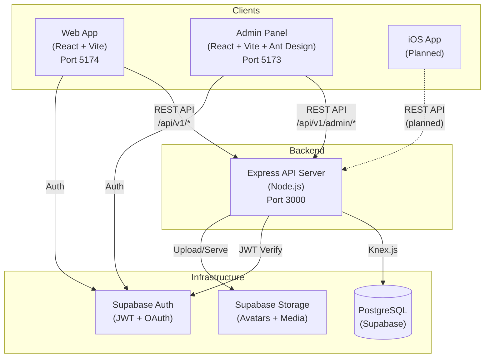
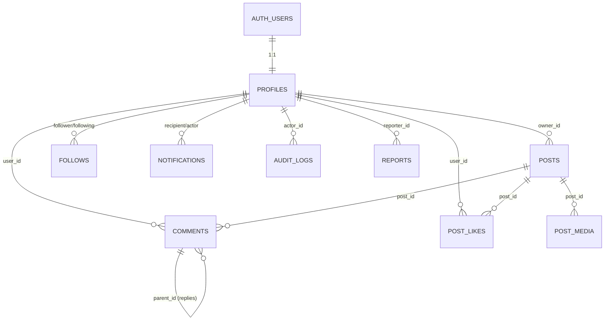

# 📋 Outstagram — Báo Cáo Tổng Hợp Toàn Bộ Dự Án

> **Dự án:** Outstagram — Social Media Platform (Instagram Clone)  
> **Ngày báo cáo:** 22/02/2026  
> **Trạng thái tổng thể:** ✅ Core MVP + Social Features + Admin Panel hoàn thành

---

## Mục Lục

1. [Tổng quan dự án](#1-tổng-quan-dự-án)
2. [Kiến trúc hệ thống](#2-kiến-trúc-hệ-thống)
3. [Tech Stack](#3-tech-stack)
4. [Database Schema](#4-database-schema)
5. [Backend API — User-facing](#5-backend-api--user-facing)
6. [Web App (Client)](#6-web-app-client)
7. [Admin Panel](#7-admin-panel)
8. [Tổng kết số liệu](#8-tổng-kết-số-liệu)
9. [Trạng thái hiện tại & Roadmap](#9-trạng-thái-hiện-tại--roadmap)

---

## 1. Tổng Quan Dự Án

**Outstagram** là một nền tảng mạng xã hội chia sẻ ảnh lấy cảm hứng từ Instagram, được xây dựng full-stack với 3 ứng dụng con:

| App | Mô tả | Port |
|-----|--------|------|
| **Web App** (`client/`) | Ứng dụng React dành cho người dùng cuối | 5174 |
| **Admin Panel** (`admin/`) | Bảng quản trị dành cho admin/moderator | 5173 |
| **Backend API** (`server/`) | Express REST API phục vụ cả 2 client | 3000 |

Kiến trúc **Monorepo** — tất cả nằm chung 1 repo Git.

---

## 2. Kiến Trúc Hệ Thống



---

## 3. Tech Stack

### Frontend (cả Web App và Admin Panel)

| Công nghệ | Web App | Admin Panel |
|-----------|---------|-------------|
| React | v18 | v18 |
| Build Tool | Vite 7.x | Vite 7.x |
| UI Framework | Custom CSS | Ant Design v5 |
| Data Fetching | Fetch API + Custom hooks | TanStack Query v5 |
| Charts | — | Recharts v2 |
| Routing | React Router v6 | React Router v6 |
| State Management | Zustand | Zustand |
| Font | — | Inter (Google Fonts) |

### Backend

| Công nghệ | Chi tiết |
|-----------|----------|
| Runtime | Node.js 20+ (ES Modules) |
| Framework | Express.js v4 |
| Database | PostgreSQL (hosted trên Supabase) |
| Query Builder | Knex.js v3 |
| Auth | Supabase Auth (JWT, jose library) |
| Storage | Supabase Storage |

---

## 4. Database Schema

### 4.1 Sơ đồ quan hệ



### 4.2 Bảng chính

| # | Bảng | Mục đích | Cột chính |
|---|------|----------|-----------|
| 1 | `profiles` | Thông tin user (1:1 với auth.users) | `user_id` (PK), `username` (UNIQUE), `display_name`, `bio`, `avatar_url`, `is_private`, `role`, `is_banned` |
| 2 | `posts` | Bài viết | `id`, `owner_id` (FK→profiles), `caption`, `is_deleted`, `created_at` |
| 3 | `post_media` | Ảnh/video đính kèm (nhiều per post) | `id`, `post_id` (FK→posts), `media_type` (ENUM: image/video), `media_url`, `position` |
| 4 | `follows` | Quan hệ follow (many-to-many) | `follower_id`, `following_id` (composite PK), constraint: no self-follow |
| 5 | `post_likes` | Likes | `post_id`, `user_id` (composite PK) |
| 6 | `comments` | Bình luận (hỗ trợ threaded replies) | `id`, `post_id`, `user_id`, `content`, `parent_id` (self-FK), `is_deleted` |
| 7 | `notifications` | Thông báo (auto-generated by DB triggers) | `id`, `recipient_id`, `actor_id`, `type` (ENUM: follow/like/comment), `post_id`, `comment_id`, `is_read` |
| 8 | `audit_logs` | Ghi log hành động admin | `id`, `actor_id`, `action`, `target_type`, `target_id`, `metadata` (JSONB) |
| 9 | `system_config` | Cấu hình hệ thống (key-value) | `key` (UNIQUE), `value` (JSONB), `updated_by` |
| 10 | `reports` | Báo cáo vi phạm | `id`, `reporter_id`, `target_type`, `target_id`, `reason`, `status`, `resolved_by` |

### 4.3 Database Features nổi bật

- **Enum types**: `media_type` (image/video), `notification_type` (follow/like/comment)
- **Auto triggers**: `set_updated_at()` tự động cập nhật `updated_at` khi UPDATE
- **Notification triggers**: Tự động tạo notification khi follow/like/comment (DB-level triggers)
- **Check constraints**: `no_self_follow`, `no_self_notify`, `caption_len ≤ 2200`, `bio_len ≤ 500`, `content_len 1-1000`
- **Indexes**: 15+ indexes tối ưu cho feed queries, follow lookups, notification fetching

### 4.4 Migrations

| # | Migration | Mô tả |
|---|-----------|-------|
| 1 | `20260115_initial-outstagram` | Tạo schema gốc: profiles, posts, post_media, follows, post_likes, comments, notifications + enums + triggers + indexes |
| 2 | `20260117_update_profiles_schema` | Cập nhật schema profiles |
| 3 | `20260117_update_trigger_google` | Xử lý trigger cho Google OAuth |
| 4 | `20260121_add_advanced_features` | Thêm advanced features |
| 5 | `20260130_notifications_triggers` | DB triggers tự động tạo notifications |
| 6-9 | Placeholder migrations | Reports, roles, stories tables |
| 10 | `20260221_admin_panel_schema` | Admin Panel: audit_logs, system_config, reports + các cột mới trong profiles |

### 4.5 Seeds

| File | Chức năng |
|------|-----------|
| `001_seed_auth_users.js` | Tạo test users trong Supabase Auth |
| `001_super_admin.js` | Tạo Super Admin account |
| `002_seed_public_data.seed.js` | Seed posts, media, follows, likes, comments |

---

## 5. Backend API — User-facing

### 5.1 Architecture

```
server/src/
├── server.js                # Entry point (dotenv + start)
├── app.js                   # Express app setup (cors, json, routes, error handler)
├── config/
│   ├── db.js                # Knex instance
│   └── supabase.js          # Supabase Admin client
├── middlewares/
│   ├── auth.js              # requireAuth — JWT verification
│   ├── admin-auth.js        # requireAdmin(minRole) — RBAC
│   ├── error.js             # Global error handler
│   ├── request-id.js        # Request ID generator
│   └── response.js          # Response helpers
├── controllers/             # 10 controllers
├── models/                  # 6 models (Knex table references)
├── services/                # 3 services (notification, feed, post)
├── routes/                  # 11 user-facing + 9 admin route files
└── utils/                   # Utility helpers
```

### 5.2 API Endpoints — User Features

#### 🔐 Authentication

| Endpoint | Method | Chức năng |
|----------|--------|-----------|
| `/api/v1/me` | GET | Lấy thông tin current user |
| `/api/v1/forgot-password` | POST | Gửi email reset password |
| `/api/v1/reset-password` | POST | Đặt lại password |
| `/api/v1/logout` | POST | Đăng xuất |

#### 👤 Profiles

| Endpoint | Method | Chức năng |
|----------|--------|-----------|
| `/api/v1/profiles/:username` | GET | Xem profile (public info + stats) |
| `/api/v1/profiles/:username/posts` | GET | Danh sách bài viết (paginated) |
| `/api/v1/profiles/me` | PUT | Cập nhật profile (display_name, bio, avatar) |
| `/api/v1/profiles/complete` | POST | Hoàn tất profile (sau khi đăng ký/OAuth) |

#### 📝 Posts

| Endpoint | Method | Chức năng |
|----------|--------|-----------|
| `/api/v1/posts` | POST | Tạo bài viết mới (caption + media upload) |
| `/api/v1/posts/:id` | GET | Xem chi tiết bài viết |
| `/api/v1/posts/:id` | PUT | Sửa caption |
| `/api/v1/posts/:id` | DELETE | Xóa bài viết (soft-delete) |

#### ❤️ Likes

| Endpoint | Method | Chức năng |
|----------|--------|-----------|
| `/api/v1/likes/:postId` | POST | Like bài viết |
| `/api/v1/likes/:postId` | DELETE | Unlike bài viết |

#### 💬 Comments

| Endpoint | Method | Chức năng |
|----------|--------|-----------|
| `/api/v1/comments/:postId` | GET | Danh sách comments (paginated) |
| `/api/v1/comments/:postId` | POST | Tạo comment (hỗ trợ reply via parent_id) |

#### 👥 Follows

| Endpoint | Method | Chức năng |
|----------|--------|-----------|
| `/api/v1/users/:id/follow` | POST | Follow user |
| `/api/v1/users/:id/unfollow` | DELETE | Unfollow user |
| `/api/v1/follows/:id/followers` | GET | Danh sách followers |
| `/api/v1/follows/:id/following` | GET | Danh sách following |

#### 📰 Feed

| Endpoint | Method | Chức năng |
|----------|--------|-----------|
| `/api/feed` | GET | Feed bài viết (từ những người đang follow, paginated) |

#### 🔔 Notifications

| Endpoint | Method | Chức năng |
|----------|--------|-----------|
| `/api/notifications` | GET | Danh sách thông báo (paginated) |
| `/api/notifications/unread-count` | GET | Số thông báo chưa đọc |
| `/api/notifications/:id/read` | PATCH | Đánh dấu đã đọc |
| `/api/notifications/read-all` | PATCH | Đánh dấu tất cả đã đọc |

#### 🔍 Search

| Endpoint | Method | Chức năng |
|----------|--------|-----------|
| `/api/v1/search` | GET | Tìm kiếm user theo username/display_name |

#### Usernames

| Endpoint | Method | Chức năng |
|----------|--------|-----------|
| `/api/usernames/check` | GET | Kiểm tra username có sẵn |

---

## 6. Web App (Client)

### 6.1 Tính năng đã triển khai

| # | Feature | Mô tả |
|---|---------|-------|
| 1 | **Authentication** | Đăng nhập/Đăng ký (Email + Google OAuth), Forgot/Reset Password, Auth Callback |
| 2 | **Complete Profile** | Hoàn tất thông tin profile sau đăng ký (username, display name, avatar) |
| 3 | **Feed** | Newsfeed hiển thị bài viết từ những người đang follow (infinite scroll) |
| 4 | **Create Post** | Tạo bài viết với caption + upload nhiều ảnh/video (drag & drop, preview) |
| 5 | **Post Detail** | Xem chi tiết bài viết: ảnh gallery, caption, comments, likes, share |
| 6 | **Edit/Delete Post** | Sửa caption, xóa bài viết (options modal "...") |
| 7 | **Like/Unlike** | Like/unlike bài viết (toggle, realtime count update) |
| 8 | **Comments** | Bình luận bài viết, hỗ trợ threaded replies |
| 9 | **User Profile** | Xem profile (avatar, bio, stats, post grid), phân biệt own profile vs others |
| 10 | **Edit Profile** | Sửa display name, bio, avatar |
| 11 | **Follow/Unfollow** | Follow/unfollow user, danh sách followers/following |
| 12 | **Notifications** | Thông báo follow/like/comment, bell icon + unread count badge, mark all read |
| 13 | **Search** | Tìm kiếm user theo username hoặc display name |

### 6.2 Pages (15 trang)

| Page | Route | File | Mô tả |
|------|-------|------|-------|
| Login | `/login` | `Login.jsx` | Trang đăng nhập (form + Google OAuth) |
| Register | `/register` | `Register.jsx` | Trang đăng ký |
| Auth Callback | `/auth/callback` | `AuthCallback.jsx` | Xử lý redirect sau OAuth |
| Complete Profile | `/complete-profile` | `CompleteProfile.jsx` | Hoàn tất profile |
| Forgot Password | `/forgot-password` | `ForgotPassword.jsx` | Quên mật khẩu |
| Reset Password | `/reset-password` | `ResetPassword.jsx` | Đặt lại mật khẩu |
| Feed | `/feed` | `Feed.jsx` | Newsfeed chính |
| New Post | `/new` | `NewPost.jsx` | Tạo bài viết mới |
| Post Detail | `/p/:postId` | `PostDetail.jsx` | Chi tiết bài viết |
| Profile | `/profile/:username` | `Profile.jsx` | Trang profile user |
| Edit Profile | `/profile/edit` | `EditProfile.jsx` | Chỉnh sửa profile |
| Followers List | `/:username/followers` | `FollowersList.jsx` | Danh sách followers |
| Following List | `/:username/following` | `FollowingList.jsx` | Danh sách following |
| Notifications | `/notifications` | `Notifications.jsx` | Trang thông báo |
| Search | `/search` | `SearchPage.jsx` | Trang tìm kiếm |

### 6.3 Components (13 shared components)

| Component | Chức năng |
|-----------|-----------|
| `AppHeader.jsx` | Header chính (logo, nav, notification bell, profile menu) |
| `PostCard.jsx` | Card bài viết trong feed (ảnh, caption, like, comment) |
| `CreatePostModal.jsx` | Modal tạo bài viết (upload, preview, caption) |
| `EditPostModal.jsx` | Modal sửa caption |
| `PostOptionsModal.jsx` | Modal "..." options (edit, delete, copy link) |
| `FollowButton.jsx` | Nút Follow/Unfollow |
| `NotificationBell.jsx` | Icon thông báo + unread count badge |
| `Avatar.jsx` | Avatar component (fallback, sizes) |
| `LoginForm.jsx` | Form đăng nhập |
| `LoginView.jsx` | Giao diện trang login |
| `RegisterForm.jsx` | Form đăng ký (validation) |
| `ErrorBoundary.jsx` | Error boundary React |
| `requireAuth.jsx` | HOC bảo vệ route cần authentication |

### 6.4 Layouts

| Layout | Chức năng |
|--------|-----------|
| `MainLayout.jsx` | Layout chính: Header + Sidebar + Content |
| `AuthLayout.jsx` | Layout cho trang auth (login/register) |

### 6.5 Styles
- **20 file CSS** riêng biệt cho từng component/page
- Phong cách: Instagram-inspired, responsive, custom CSS thuần

---

## 7. Admin Panel

> Xem chi tiết đầy đủ: [Admin_Panel_Report.md](./Admin_Panel_Report.md)

### 7.1 Tóm tắt

| Feature | Chi tiết |
|---------|----------|
| **Phân quyền** | RBAC 3 cấp: Super Admin / Admin / Moderator |
| **Dashboard** | 4 stat cards + 3 biểu đồ analytics (Recharts) |
| **User Management** | CRUD, Ban/Unban, Create User, Details Modal |
| **Post Management** | View/Soft-delete/Restore, Details Modal + Media Gallery |
| **Comment Management** | View/Soft-delete/Restore |
| **Reports System** | Queue + Resolve/Dismiss + Filter |
| **Role Management** | View/Change roles (Super Admin only) |
| **Audit Logs** | History mọi hành động admin, filter by action |
| **System Config** | Feature toggles + Value settings (Super Admin only) |
| **Code Quality** | Refactored: Feature-based folders, CSS tách riêng, no inline styles |

### 7.2 Admin API Endpoints (~25 endpoints)

| Namespace | Endpoints |
|-----------|-----------|
| `GET/POST /admin/users` | List, Detail, Create, Ban, Unban |
| `GET/PATCH/DELETE /admin/posts` | List, Detail, Soft-delete, Hard-delete |
| `GET/PATCH/DELETE /admin/comments` | List, Soft-delete, Hard-delete |
| `GET/PATCH /admin/reports` | List, Resolve, Dismiss |
| `GET/PATCH /admin/roles` | List Admins, Change Role |
| `GET /admin/dashboard` | Stats + 3 Chart APIs |
| `GET/PATCH /admin/config` | Get All, Update |
| `GET /admin/audit-logs` | List (filter by action) |

---

## 8. Tổng Kết Số Liệu

### Toàn dự án

| Metric | Số lượng |
|--------|----------|
| **Ứng dụng** | 3 (Web App + Admin Panel + Backend API) |
| **Database Tables** | 10 |
| **Database Migrations** | 10 |
| **Database Seeds** | 3 |
| **DB Indexes** | 15+ |
| **DB Triggers** | 5+ (updated_at + notification triggers) |

### Backend

| Metric | Số lượng |
|--------|----------|
| **Controllers** | 10 |
| **Models** | 6 |
| **Services** | 3 |
| **Middlewares** | 5 |
| **Route Files** | 20 (11 user-facing + 9 admin) |
| **API Endpoints (User)** | ~25 |
| **API Endpoints (Admin)** | ~25 |
| **Tổng API Endpoints** | **~50** |

### Web App (Client)

| Metric | Số lượng |
|--------|----------|
| **Pages** | 15 |
| **Components** | 13 |
| **Layouts** | 2 |
| **CSS Files** | 20 |
| **Routes** | 15 |

### Admin Panel

| Metric | Số lượng |
|--------|----------|
| **Pages** | 9 |
| **CSS Files** | 10 |
| **Layouts** | 1 |

---

## 9. Trạng Thái Hiện Tại & Roadmap

### ✅ Đã Hoàn Thành

| Phase | Nội dung |
|-------|----------|
| **Core MVP** | Auth, Posts (CRUD), Feed, Profile, Media Upload |
| **Social Features** | Follow/Unfollow, Likes, Comments (threaded), Search |
| **Notifications** | DB Triggers + API + UI (Bell + Page + Mark Read) |
| **Post Management** | Edit caption, Delete post, Options modal |
| **Admin Panel Phase 1** | Dashboard, User/Post/Comment Management, Audit Logs |
| **Admin Panel Phase 2** | Reports, Roles, System Config, Analytics Charts |
| **Admin Refactoring** | Feature-based folders, CSS tách riêng, cleanup boilerplate |

### 🔜 Có thể triển khai tiếp

| Feature | Ưu tiên | Mô tả |
|---------|---------|-------|
| **iOS App** | Cao | Native iOS client (spec đã có: `docs/iOS_Integration_Spec.md`) |
| **Stories** | Trung bình | Stories 24h (DB tables đã tạo placeholder) |
| **Direct Messages** | Trung bình | Chat 1-1, group chat |
| **Realtime** | Trung bình | Supabase Realtime cho likes/comments/notifications |
| **Admin Phase 3** | Thấp | Redis cache, CSV export, bulk actions, 2FA |
| **Explore/Discover** | Thấp | Trang khám phá, suggested users, trending |
